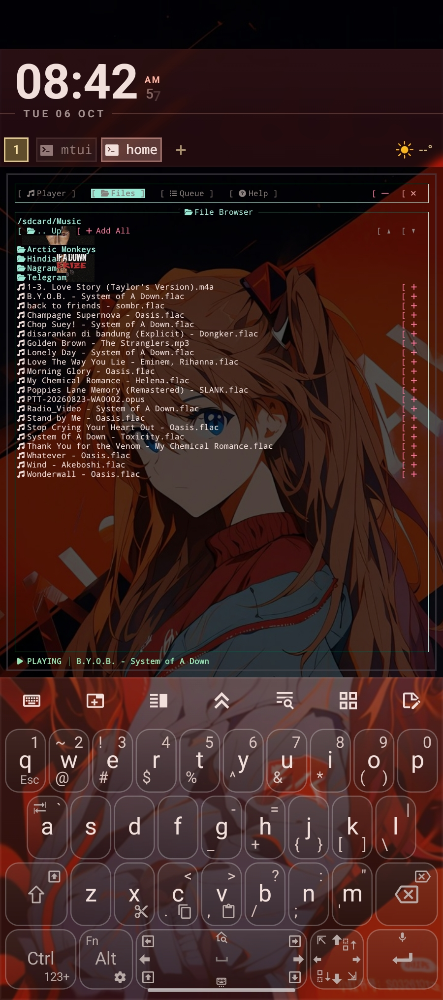
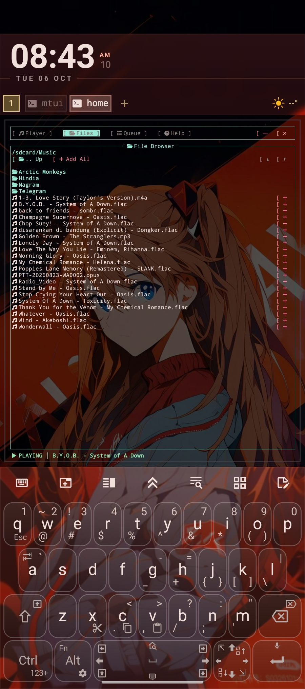
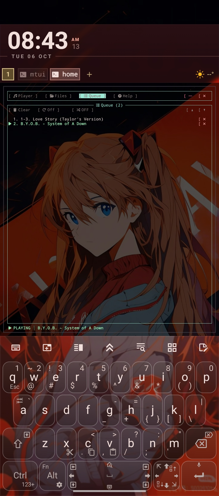
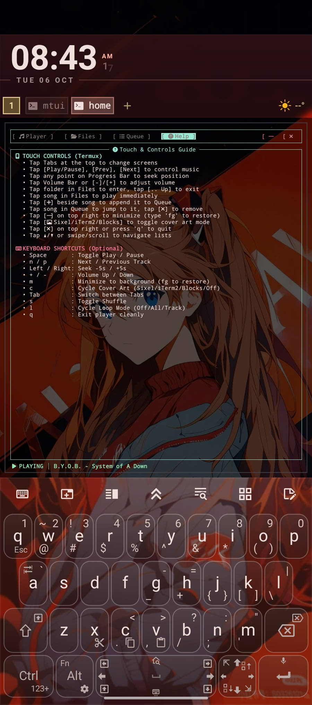
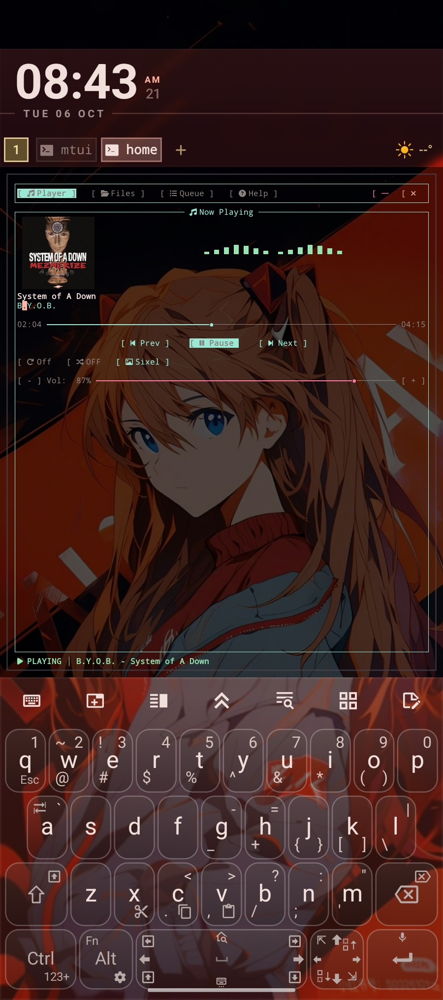

# mtui - Mobile Terminal Music Player

A lightweight, high-performance, battery-friendly TUI Music Player built with Rust, specifically optimized for **Termux on Android** with **first-class Touch support**, a **strictly decoupled audio engine**, and **album cover art (Sixel & iTerm2)**.

---

## 📸 Showcase

<div align="center">

|  Now Playing |  File Browser |
|:---:|:---:|
|  |  |

|  Queue List |  Cover Art |  Help & Controls |
|:---:|:---:|:---:|
|  |  |  |

</div>

---

## ⚡ Instant Installation (No Compilation Needed!)

### 🚀 One-Liner Installer (Recommended)

Run this single command in Termux to automatically install runtime dependencies (`mpv`, `ffmpeg`, `chafa`), download the **prebuilt binary (aarch64)** from GitHub Releases, and install `mtui` directly into your `$PATH` in **under 3 seconds** without compiling Rust:

```bash
curl -sSL https://raw.githubusercontent.com/fatuhsa/mtui/main/install.sh | bash
```

---

### 📋 Prerequisites (For Building from Source)

If you compile from source instead of using the prebuilt binary, ensure you have:

| Tool | Purpose | Install Command (Termux) |
|---|---|---|
| **mpv** | Audio playback engine | `pkg install mpv` |
| **ffmpeg** | Embedded album art extraction | `pkg install ffmpeg` |
| **chafa** | Sixel / iTerm2 / Block image rendering | `pkg install chafa` |
| **Rust / Cargo** | Binary compilation | `pkg install rust` |
| **Nerd Font** | Terminal icons (, , , etc.) | Any Nerd Font in Termux |

---

### 📦 Manual Installation via Cargo

If you prefer building locally:

```bash
pkg install -y rust mpv ffmpeg chafa git
cargo install --git https://github.com/fatuhsa/mtui.git --bin mtui
```

---

### 🛠️ Build from Source

```bash
git clone https://github.com/fatuhsa/mtui.git
cd mtui
cargo build --release
cp target/release/mtui $PREFIX/bin/mtui
```

---

## 🚀 How to Run

Once installed, simply run:

```bash
mtui
```

---

## ✨ Features

- ** 100% Touch-Friendly (Termux SGR 1006 Mouse Tracking)**:
  - **Tabs**: Tap top tabs (`[  Player ]`, `[  Files ]`, `[  Queue ]`, `[  Help ]`, `[  ]`, `[  ]`) with one thumb.
  - **Interactive Seek Bar**: Tap *anywhere* along the progress bar to instantly seek to that position.
  - **Interactive Volume Bar**: Tap directly on the volume bar or use `[-]` / `[+]` buttons to change volume.
  - **Large Touch Buttons**: Dedicated padded buttons for `[ Prev]`, `[ Play /  Pause]`, `[ Next]`, `[ Loop]`, and `[ Shuffle]`.
  - **Touch File Browser**: Tap folders to open, tap songs to play immediately, or tap `[]` to queue without interrupting playback.
  - **Queue Management**: Tap any track to jump to it, tap `[]` to remove from queue.
  - **Scroll Gestures**: Touch drag / scroll gestures and `[▲] / [▼]` buttons to scroll long lists.
- **🖼️ Album Cover Art (Sixel / iTerm2 / Blocks)**:
  - Automatically extracts embedded album art from FLAC, MP3, M4A, OPUS, OGG files via `ffmpeg` (or local `cover.jpg`/`cover.png`).
  - High-performance conversion using `chafa` with support for **Sixel graphics**, **iTerm2 inline protocol**, and **ANSI high-res Unicode Half-Blocks**.
  - Tappable button `[  Sixel ]` (or shortcut `c`) to switch protocols in real-time.
  - Background worker thread guarantees 0 UI stutter or frame drops during extraction.
- **🪟 Minimize to Shell (`[  ]` / `m`)**:
  - Tapping `[  ]` suspends the TUI safely to the Termux bash shell via `SIGTSTP`.
  - **Audio continues playing seamlessly in the background** while you use other shell commands.
  - Type `fg` in Termux at any time to instantly restore the full TUI!
- **⚡ Termux & Battery Optimized**:
  - Native Rust binary (~1.6 MB), minimal RAM (< 15 MB) and near-zero idle CPU usage.
  - Automatic screen adaptation: supports narrow phone portrait screens (< 50 cols) with title marquee scrolling, as well as landscape/tablet split views.
  - Built-in MPV backend with native Android OpenSL ES / AAudio drivers.
  - Auto-discovery of `/sdcard/Music` and `~/storage/music`.
- **🧩 Completely Decoupled Architecture**:
  - The **Audio Engine** (`src/engine/`) is an independent, stateful service with **zero Ratatui / UI dependencies**.
  - Communicates via clean `EngineCommand` and `EngineStateSnapshot` channels.
  - The entire UI layer (`src/ui/`) can be ripped out, redesigned, or replaced without changing any engine code.

---

##  Navigation & Controls

### Touch Gestures
| Gesture / Tap Target | Action |
|---|---|
| **Tabs (`Player`, `Files`, `Queue`, `Help`)** | Switch active screen |
| **Progress Bar** | Tap at any point (e.g. middle for 50%) to seek |
| **Volume Bar / `[-]` / `[+]`** | Adjust volume |
| **`[ Play]` / `[ Pause]`** | Toggle playback |
| **`[ Prev]` / `[ Next]`** | Change track (or restart if > 3s) |
| **`[ Loop]`** | Cycle Loop Mode (`Off` → `All` → `Track`) |
| **`[ Shuffle]`** | Toggle Shuffle Mode |
| **File Browser List** | Tap folder to enter, tap song to play, tap `[]` to queue |
| **`[ .. Up]`** | Navigate to parent directory |
| **`[ Add All]`** | Add all songs in folder to queue |
| **Queue List** | Tap song to play, tap `[]` to delete from queue |
| **`[  ]` (Top right)** | Minimize to background shell (type `fg` to restore) |
| **`[  Sixel ]`** | Cycle cover art protocol (`Sixel` → `iTerm2` → `Blocks` → `Off`) |
| **`[  ]` (Top right)** | Quit player cleanly |

### Keyboard Shortcuts (Optional)
| Key | Action |
|---|---|
| `Space` | Toggle Play / Pause |
| `n` / `p` | Next / Previous track |
| `Left` / `Right` | Seek -5s / +5s |
| `+` / `-` | Volume Up / Down |
| `m` | Minimize to shell (type `fg` to restore) |
| `c` | Cycle Cover Art Mode (`Sixel`, `iTerm2`, `Blocks`, `Off`) |
| `Tab` | Cycle through screens |
| `s` | Toggle Shuffle |
| `l` | Cycle Loop mode |
| `q` | Quit player cleanly |

---

## 🏗️ Architecture: Swappable UI & Independent Engine

```
mtui/
├── install.sh                  # One-liner automated installer
├── src/
│   ├── main.rs                 # Terminal setup, SGR mouse capture, event loop, suspend
│   ├── engine/                 # 100% PURE AUDIO ENGINE (Zero UI code)
│   │   ├── mod.rs              # AudioEngine coordinator & background worker thread
│   │   ├── backend.rs          # AudioBackend trait + MpvBackend (IPC) + MockBackend
│   │   ├── commands.rs         # EngineCommand enum
│   │   ├── events.rs           # EngineStateSnapshot & PlaybackStatus
│   │   ├── playlist.rs         # Queue, history, Fisher-Yates shuffle, loop modes
│   │   └── track.rs            # Track metadata & audio file detection
│   ├── ui/                     # DETACHED UI PRESENTATION LAYER
│   │   ├── mod.rs              # AppUi coordinator
│   │   ├── cover.rs            # Async Sixel / iTerm2 / HalfBlock cover art renderer
│   │   ├── hitmap.rs           # TouchHitMap for declarative touch tap & slider resolution
│   │   ├── theme.rs            # Mobile high-contrast color palettes
│   │   ├── responsive.rs       # Compact (portrait) vs Wide (landscape) detector
│   │   ├── widgets/            # TouchButton, TouchBar (slider), Marquee (ticker)
│   │   └── views/              # Swappable views: NowPlaying, FileBrowser, Queue, Help
│   └── util/
│       ├── cover.rs            # Embedded cover art extraction via ffmpeg
│       └── storage.rs          # Android storage auto-discovery (/sdcard/Music, ~/storage/music)
└── tests/
    └── engine_tests.rs         # Automated tests for engine logic and touch resolution
```

---

## 🧪 Automated Tests

```bash
cargo test
```

All 5 core engine, playlist, shuffle, and touch hit-mapping tests pass out-of-the-box.
